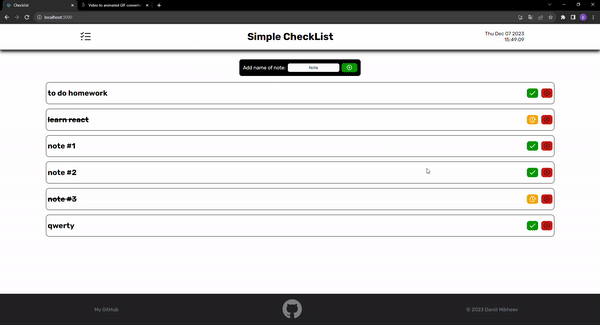

# Creating simple checklist app at React

## You can:

- Save notes (by LocalStorage)
- Add new notes
- Edit notes
- Delete notes
- Crossing out notes if you finish it
- Choose day which you need to make a note
- Use calendar

## Deleting/Add the tasks

## Editing task

## Crossing out if the task is completed

## Save tasks and add tasks at another day

